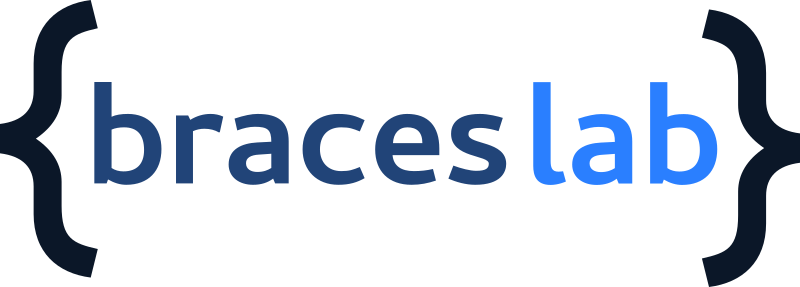
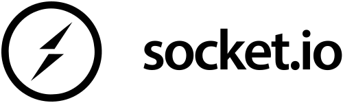
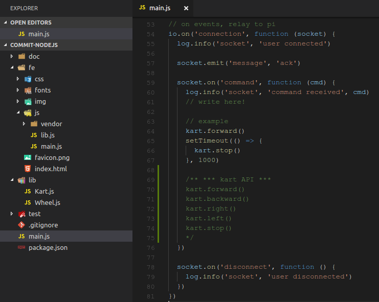

# Node.js Grand Prix


## Firenze, 20/07/17

---

## Sanfratello Simone



## www.braceslab.com

---


> https://nodejs.org  
> Node.js® is a JavaScript runtime built on Chrome's V8 JavaScript engine.  
> Node.js uses an event-driven, non-blocking I/O model that makes it lightweight and efficient.  
> Node.js' package ecosystem, npm, is the largest  ecosystem of open source libraries in the world.  

---

### Last 2 years of Node.js

- v. 0.12 (2015) > 8.0 LTS (2017)
  - +io.js, 4, 5, 6, 7, 8

- ECMAScript 6 (2016)
  - v.8 99%
  - v.4 57%
  - v.0.12 31%

- ECMAScript 7 (2017)
  - v.8 67%

- Release v. 8: Google, IBM, Intel, Microsoft, nearForm and NodeSource

- callback (pyramid of doom), Promises, channels (async-await)

- Microsoft & node-chakracore

- IDE (debug!)
  - Visual Studio Code

---


https://www.raspberrypi.org

- IoT leader

- Low Cost: 3 B 40$, Zero 5$, Zero W $11

- hardware modules: GPIO (General Purpouse IO)

- software support: Debian, Android

- Python, Go, Node.js, C, C++

---



https://socket.io

- WebSocket & HTTP fallback
- Real Time (soft)
- event based communication

#### server
````js
socket.on('message', function (content) {
  console.log('socket', 'message', content)
})
````

#### client
````js
socket.emit('message', 'ack')
````

---


http://johnny-five.io

- JavaScript Robotics & IoT Platform
- Board support, API hardware components

````js
const five = require('johnny-five')
const Raspi = require('raspi-io')

const board = new five.Board({ io: new Raspi() })
const pin = new five.Pin('GPIO9')

pin.write(0)
pin.write(1)
````

---

#### backend



---

#### frontend


---

# Ready? Go!

````bash
ssh pi@192.168.1.151
password: braceslab
````

````bash
sudo -i
cd /home/pi/nodejs-gp
sudo node main.js
````

### edit fe/js/main.js

### edit main.js

### browser @ 192.168.1.123

**Full project @ https://github.com/braceslab/nodejs-gp**
